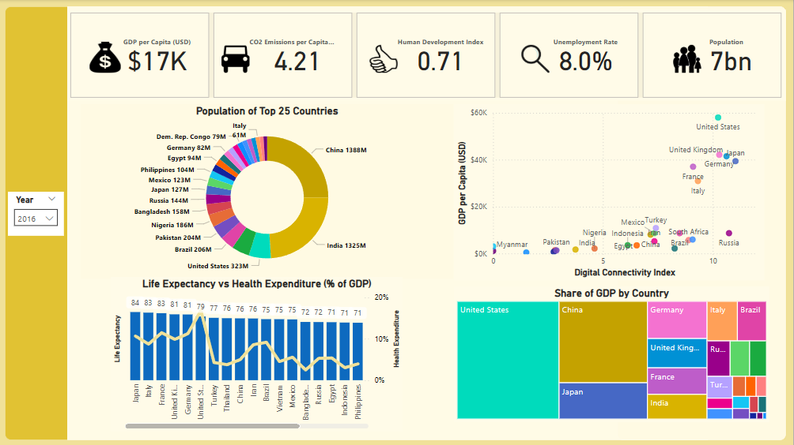
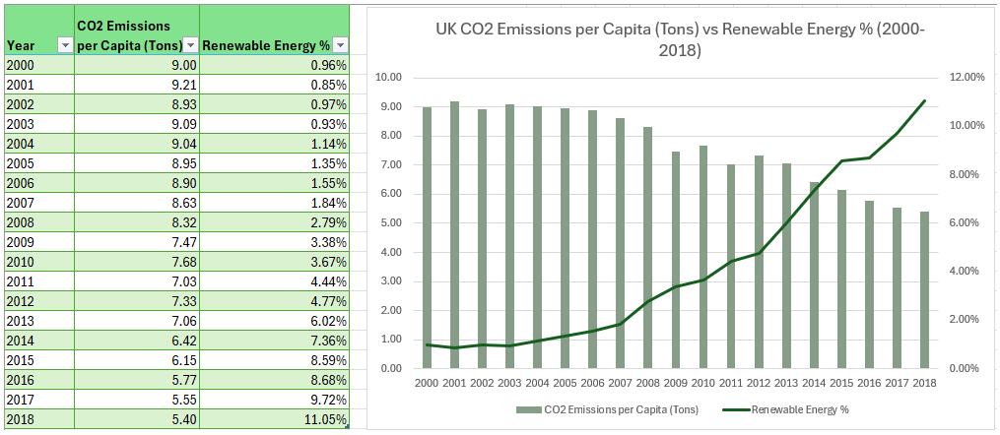
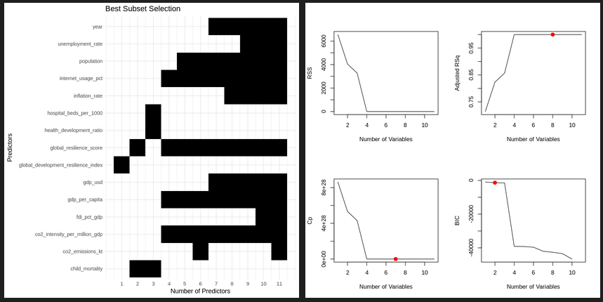

# 🌍 Global Indicators Visualisation and Analysis
## Overview

### The [Global Development Indicators dataset](https://www.kaggle.com/datasets/michaelmatta0/global-development-indicators-2000-2020) is a popular dataset recently released on [Kaggle](https://www.kaggle.com). I created this project to analyse and visualise key socio-economic and environmental indicators from 2000 to 2020. I use a combination of data cleaning (Power Query), visualisation (Power BI/Excel) and analysis (R in Google Colab Notebooks) to understand the data and see if it can be used to predict Life Expectancy.

## 📊 Key Features

### Data Source: [Global indicators from 2000 to 2020.](data/raw_data.csv)

### Visuals & Metrics:

Interactable Power BI dashboards relating to Health, Environment, Economy and General (pictured below) Indicators.

PivotTables and PivotCharts of various Indicators as well as spreadsheets for the original and cleaned versions of the dataset.

Models trained for predicting Life Expectancy using R. 

Visualisations include model fits and their associated statistics. Best Subset Selection pictured below.

### Technologies Used:

&nbsp;&nbsp;&nbsp;&nbsp;&nbsp;&nbsp; &nbsp;&nbsp;&nbsp;&nbsp;&nbsp;

## 📁 Project Structure

<pre>
Global_Indicators/
├── Analysis_of_Indicators.ipynb                    # Jupyter Notebook
├── Dashboard.pbix                                  # Power BI dashboard
├── Global_Development_Indicators_2000_2020.xlsx    # Core dataset
├── data/
│ └── raw_data.csv                                  # Raw CSV dataset
├── docs/
│ └── methodology.md                                # Methodology documentation
├── images/                                         # Dashboard visuals
├── LICENSE.txt                                     # License
├── README.md                                       # This file
└── .git/                                           # Git metadata
</pre>
    

## 🔍 How to Use

### Notebook Analysis

    Open and run Analysis_of_Indicators.ipynb in Jupyter Notebooks.

    Observe the data wrangling, exploratory analysis and model fits for predicting Life Expectancy.

### Power BI Dashboard

    Open Dashboard.pbix in Microsoft Power BI Desktop.

    Interact with filters, visuals, and insights.

### Data Files

    Use Global_Development_Indicators_2000_2020.xlsx or raw_data.csv as the source for custom analysis.

## 📘 Documentation

### Please refer to docs/methodology.md for:

    Indicator definitions

    Data processing pipeline

    Visualization logic

## 📄 License

This project is licensed under the terms described in LICENSE.txt.